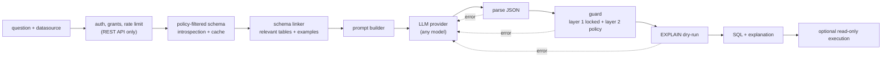

# Architecture

## Modules

| Module | Responsibility |
|---|---|
| `config.py`, `policy.py` | Settings, Layer 2 policy, consumers and grants |
| `schema/` | Catalog model, live introspection, schema files (DDL / JSON bundles), TTL cache, schema linker |
| `guard/` | `baseline.py` (Layer 1, locked) and `rules.py` (Layer 2) |
| `prompts/` | System prompt and per-question prompt building |
| `llm/` | Provider interface, OpenAI-compatible, Anthropic, fake, registry, response parsing |
| `execution/` | Read-only executor and dry-run verification |
| `engine.py` | `SQLSentry`, the public API that ties it together |
| `store/` | Generations, executions (no rows) and feedback |
| `server/` | FastAPI app, auth, rate limit, routes |
| `cli.py`, `evals.py`, `client.py` | CLI, accuracy evaluation, HTTP client |

The core (everything except `server/`) has no web-framework dependency, so it works as a
plain library and as the engine behind the API.

## Design choices

- **Accuracy over latency.** The validate-and-repair loop adds seconds, but returns SQL that parses,
  passes policy and is accepted by the database's planner.
- **Security over convenience.** Tables are default-deny. Layer 1 has no off switch.
- **Results, not text.** Evaluation compares result sets, because many SQL strings are correct.
- **Stable system prompt.** Only instructions live in the system prompt; schema and question go in
  the user message, which keeps provider-side prompt caching effective.
- **Extension points** for future enterprise features: `LLMProvider`, `Store`, `ContextProvider`
  and the auth layer.
